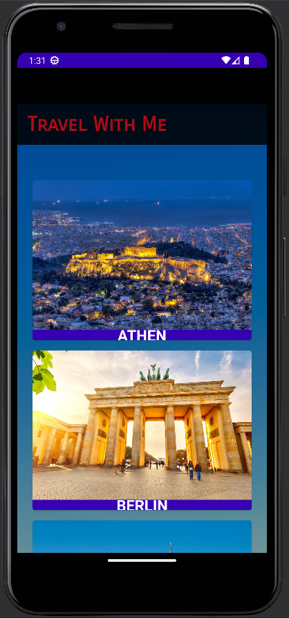
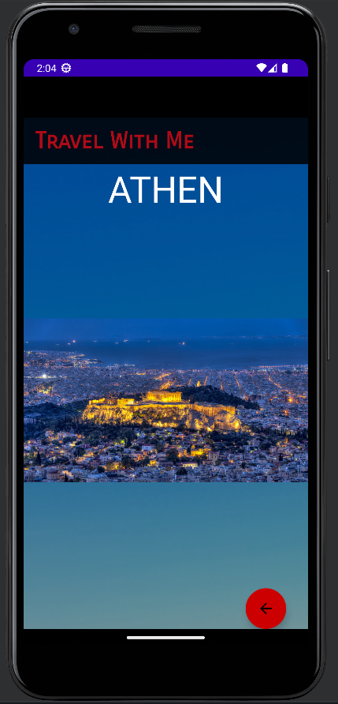

# Travel With Me

Die Firma "DreamDestinations" möchte die App "Travel With Me" entwickeln, um ihren Kunden ein erstklassiges 
Reiseerlebnis zu bieten und ihre Kundenzufriedenheit zu steigern. 
Die App ermöglicht den Nutzern, detaillierte Informationen über verschiedene Reiseziele abzurufen, 
ihre Reisen besser zu planen und ihre individuellen Vorlieben zu berücksichtigen.

---

## Aufgaben

### Vorwort

Verwende wann möglich das MVVM-Pattern, SharedViewModel und LiveData.

### Vorlage

Als Vorlage hast du ein fast neues Projekt.
Außer der MainActivity hast du keinen Code vorgegeben.
Als Ressourcen hast du ein paar Städtebilder, die Städtenamen und eine kurze Beschreibung der Stadt gegeben.

### Aufgabe 1:

- Erstelle das Home-Fragment aus **Abbildung 1**. Es enthält eine Liste an Bildern von Städten sowie deren 
Städtenamen in Form einer RecyclerView.
- Wenn der Nutzer auf ein Bild klickt, wird er zu der Detailansicht der Stadt, dargestellt in **Abbildung 2**, weitergeleitet
- Das Fragment sollte in etwa so aussehen, wie in **Abbildung 1**.

<b>Abbildung 1:</b> Das Homefragment. 

### Aufgabe 2:

- Erstelle die Detailansicht. Es enthält mindestens den Namen der Stadt, ein Bild der Stadt sowie eine kleine Beschreibung.
- Über den roten Knopf kann der Nutzer wieder zurücknavigieren.
- Die Detailansicht sollte in etwa so aussehen, wie in **Abbildung 2**.
- Du kannst deine Detailansicht erweitern, falls du noch etwas hinzufügen möchtest.

<b>Abbildung 2:</b> Die Detailansicht der Stadt Athen. 

